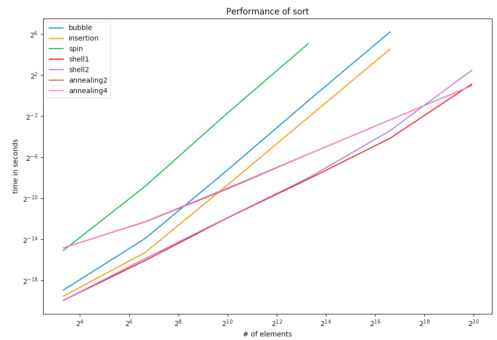
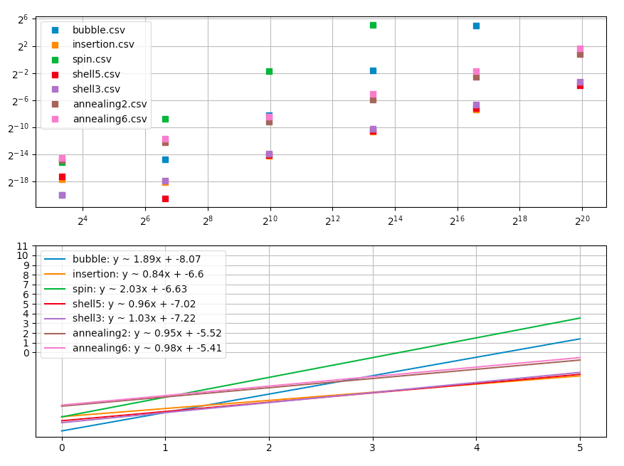

# Project 1: Testing Running Times

## **Overview**

This projects consists of the experimental anaylis of different sorting algorithm's running times. The tests are implemented as followed:

1. Implement different sorting algorithms to test. Sorting algorithms include: 

* bubble sort
* insertion sort
* spin the bottle sort
* shell sort with different gaps
* annealing sort with different temparature and repetition sequences.

2. For each sorting algorithm, perform runtime experiments on random permutations (Distribution: **Uniformly-distributed permutations**), with multiple runs for increasing problem sizes. 

3. Do the same test as in Step 2 for another distribution: **Almost-sorted permutations**.

4. For each distribution, plot the results on a log-log scale and perform regression analysis. Based on the plot, determine each algorithm's asymptotic running time.

## **Algorithms**

This section will introduce the mechanism of implementation of each algorithm. Pseudocode/C++ code of some algorithms will be shown. 

### Subroutine
When implementing sorting algorithms, one subroutine that is usually used is to swap two elements by its indices in the list.

C++ code:

```c++
void swap_element(int& a, int& b) {
    int c = a;
    a = b;
    b = c;
}
```

### Bubble sort

Bubble sort algorithm repeated scan a list of elements, exchanging elements if they are not relevant order (to bubble the largest element to the right of the list), until all elements have been placed in their proper order.

Given n elements in the list, in the first scan, the algorithm will bubble the largest value to the rightmost position of the list, which may have at most n-1 swap operations. In the second scan, it will bubble the second largest value to the second rightmost position of the list, which may have at most n-2 swap operations, etc.

In total, the largest possible number of swap operations is: `(n - 1) + (n - 2) + ... + 1`, which is bounded by `O(N^2)`.

C++ code:

```c++
void bubble_sort(std::vector<int>& nums) {
    int size = nums.size();
    for (int i = 0; i < size; ++i) {
        for (int j = 1; j < size - i; ++j) {
            if (nums[j] < nums[j - 1]) {
                swap_element(nums[j-1], nums[j]);
            }
        }
    }
}
```

### Insertion sort

Insertion sort first considers the first item to be a sorted list. Then, it insert the second item to the sorted list ans keep swapping elements if needed. Repeat the steps until it processes the last elements in the list. For each step, the element will be inserted into its proper position of the given sorted list.

The largest possible number of operations is bounded by `O(N^2)`.

C++ code:

```c++
void insertion_sort(std::vector<int>& nums) {
    int size = nums.size();
    for (int i = 1; i < size; ++i) {
        int tmp = nums[i];
        int k = i;
        while (k > 0 && tmp < nums[k - 1]) {
            nums[k] = nums[k - 1];
            --k;
        }
        nums[k] = tmp;
    }
}
```

### Spin the bottle sort

Spin the bottle sort repeated scan the list untit the list is sorted. In each iteration, it uniformly chooses an element and performs swap operation with current scanned element if needed.
Best case complexity: `Omega(N^2 LogN)`.
C++ code:

```c++
void spin_the_bottle_sort(std::vector<int>& nums) {
    int size = nums.size();
    mt19937 mt = get_mersenne_twister_generator_with_current_time_seed();
    uniform_int_distribution<int> ui = get_uniform_int_generator(0, size-1);
    while (!is_sorted(nums.begin(), nums.end())) {
        for (int i = 0; i < size; ++i) {
            int s = ui(mt);
            if ((i < s && nums[i] > nums[s]) || (i > s && nums[i] < nums[s])) {
                swap_element(nums[i], nums[s]);
            }
        }
    }
}
```

### Shell sort

Based on the fact that insertion sort has linear run time if the input is already sorted, shell sort orders the list by comparing elements that are separated by decreasing gap numbers. A gap sequence that contains 1 can ensure the this algorithm is correct.

When testing this algorithm, some different gap sequences will be used to find which two gap sequences are the best two. All of the gap sequences running time of different size will be plotted in one graph. In this way, the best two sequences that has the fastest asymptotic running time can be found. Worst case complexity: `O(N(logN)^2)`

C++ code:

```c++
void shell_sort(std::vector<int>& nums, const std::vector<int>& gaps) {
    int size = nums.size();
    for (auto gap : gaps) {
        for (int i = gap; i < size; ++i) {
            int tmp = nums[i];
            int j = i;
            while (j >= gap && tmp < nums[j-gap]) {
                nums[j] = nums[j - gap];
                j -= gap;
            }
            nums[j] = tmp;
        }
    }
}
```

### Annealing sort

Inspired by simulated annealing meta-heuristic, which involves solving a problem by a sequence of choices from the nubmer of r_j neighbors and T_j distance. Complexity: `O(NlogN)`.

Pseudocode:

```Pseudocode
for j = 1 to t do
    for i = 1 to n − 1 do
        for k = 1 to r_j do
            Let s be a random integer in the range [i + 1, min{n, i + T_j}].
            if A[i] > A[s] then
                Swap A[i] and A[s]
    for i = n downto 2 do
        for k = 1 to r_j do
            Let s be a random integer in the range [max{1, i − T_j}, i − 1].
            if A[s] > A[i] then
                Swap A[i] and A[s]
```

## **Runtime Testing Methods**

Running time experiments will be tested on two distributions: **Uniformly distributed permutations** and **Almost-sorted permutations**. For each distribution, run experiments for increasing problem size, for example, 10, 100, 1000, 10,000, 100,000, 1,000,000 elements. For each problem size, generate 3 random permutation of the current testing distribution. For each permutation, run 3 times and pick the minimum running time. Then, average the 3 minimum running time of the 3 different permutations. This average running time is running time of the algorithm for its current problem size.

***NOTE***: To prevent external process affect the result of experiments, pick the minimum running time of each permutation and average minimum running times of different permutations.

Shell sort and annealing sort are tested using different sequences. The best two sequences of annealing sort and shell sort will be shown in the graph with other sorting algorithms. All of the sequences of shell sort and annealing sort will be shown separately.

Result of running time experiments will be ploted on a log-log scale. In this case, comparing the slope of the line can find which sorting algorithm is the fastest.

Regression analysis will also be performed on the results of running time experiments.

## **Testing Results**

Testing results of different sorting algorithms will be shown for the following distribution. **Note** that shell sort and annealing sort are tested over different parameters.

For shell sort, it is tested using the following gap sequences.

* Shell 1 (Gap 1): [1601, 801, 300, 132, 57, 10, 1]

* Shell 2 (Gap 2): [600, 280, 75, 25, 8, 1]

* Shell 3 (Gap 3): [148, 99, 50, 1]

* Shell 4 (Gap 4): [256, 128, 64, 32, 16, 8, 4, 2, 1]

* Shell 5 (Gap 5): [200, 190, 180, 170, 160, 150]

* Shell 6 (Gap 6): [887, 510, 377, 233, 144, 89, 55, 34, 21, 13, 8, 5, 3, 2, 2, 1]

For annealing sort, it is tested over the following temparature and repetition sequences.

* Annealing 1 (Temp 1: [1600, 800, 400, 200, 100, 50, 25, 0], Rep 1: [5, 5, 5, 5, 5, 5, 5, 0])

* Annealing 2 (Temp 2: [1000, 800, 600, 400, 200, 0], Rep 2: [2, 2, 2, 2, 2, 0])

* Annealing 3 (Temp 3: [1024, 512, 216, 128, 64, 32, 16, 8, 4, 2, 1, 0], Rep 3: [7, 7, 7, 7, 7, 7, 7, 7, 7, 7, 7, 0])

* Annealing 4 (Temp 4: [1597, 987, 610, 377, 233, 144, 89, 55, 34, 21, 13, 8, 5, 3, 2, 1], Rep 4: [2, 2, 2, 2, 2, 2, 2, 2,2, 2, 2, 2, 2, 2, 2, 0])

* Annealing 5 (Temp 5: [256, 64, 16, 4, 0], Rep 5: [5, 5, 5, 5, 0])

* Annealing 6: (Temp 6: [1000, 850, 700, 550, 400, 250, 0], Rep 6: [3, 3, 3, 3, 3, 3, 0])

### Uniformly distributed permutations

In this section, the input testing data is permuted using uniformly distributed permutation.

1. The graph below shows the running time of different algorithms on increasing problem size. For shell sort and annealing sort, only the best two cases are shown in this graph.

    

    Among all the sorting algorithms tested, annealing 2 is the fastest.

2. Perform regression analysis of the running time experiements. For shell sort and annealing sort, only the best two cases are shown in this graph.

    

    Regression analysis also shows annealing 2 has the smallest slope on log-log scale which means it is the fastest.

3. The following graph shows the running time of shell sort over all different gap sequences above:

    

    The best two cases of shell sort are: shell 1 and shell 2. And shell 1 is even faster than shell 2. Overall, gap sequence: [1601, 801, 300, 132, 57, 10, 1] has the best performance.

4. The following graph shows the running time of annealing sort over all different temparature sequences and repetition sequences above:

    

    The best two cases of annealing sort are: annealing 2 (orange line) and annealing 4 (red line). The lines of these two different parameters almost overlapped. Annealing 2 is a little bit better than annealing 4.

    Annealing 2 has temparature sequence: [1000, 800, 600, 400, 200, 0] and reqetition sequence: [2, 2, 2, 2, 2, 0]

### Almost-sorted permutations

In this section, the input testing data is almost sorted by independently choosing 2logn pairs, (i, j), where i and j are uniformly-chosen random integers in the range from 0 to n-1, and swap the numbers at positions i and j in the array/vector.

1. The graph below shows the running time of different algorithms on increasing problem size.

    

    Among all the sorting algorithms tested, insertion sort is the fastest.

2. Regression analysis of the running time experiements

    

    Regression analysis also shows insertion sort has the smallest slope on log-log scale which means it is the fastest.

3. The following graph shows the running time of shell sort over all different gap sequences:

    

    The best two cases of shell sort are: shell 3 and shell 5. And shell 5 is even faster than shell 3. Overall, gap sequence: [200, 190, 180, 170, 160, 150] has the best performance.

4. The following graph shows the running time of annealing sort over all different temparature sequences and repetition sequences:

    

    The best two cases of annealing sort are: annealing 2 and annealing 6.
    Annealing 2 has a faster run time than annealing 6.

    Annealing 2 has temparature sequence: [1000, 800, 600, 400, 200, 0] and reqetition sequence: [2, 2, 2, 2, 2, 0]

## Conclusion

Overall, annealing sort 2 is the fastest when input testing data is in uniformly distributed permutations, because annealing sort 2 has the fastest running time over 1000,000 elements and smallest slope in regression analysis. And insertion sort is the fastest when input testing data in almost-sorted permutations, because insertion sort has the fastest running time and smallest slope. In almost-sorted distribution, insertion needs much less swap operation than other algorithms.
